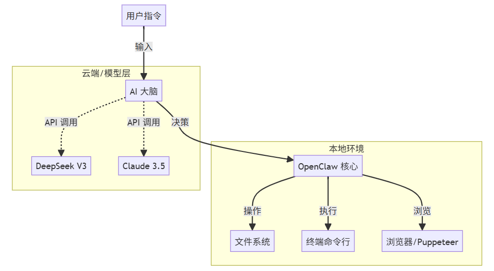

# 什么是 OpenClaw?

OpenClaw（前身名为 Clawdbot/Moltbot）是一个开源的、**本地优先 (Local-First)** 的 AI Agent 框架。

不同于只能在网页里聊天的 ChatGPT，OpenClaw 是一个能**接管你键鼠权限**的超级助理。它运行在你的终端里，直接调用系统 API 来完成复杂任务。

## 核心架构图

## 为什么选择 OpenClaw CN?

原版项目虽然强大，但针对中国开发者存在明显的“水土不服”。OpenClaw CN 社区致力于解决以下痛点：

| 特性 | 原版 (Official) | CN 社区版 (Ours) |
| :--- | :--- | :--- |
| **AI 模型** | 强依赖 Claude (昂贵/易封号) | **原生适配 DeepSeek / Qwen** |
| **网络环境** | 需时刻开启魔法 | **配置国内镜像源 (npm/docker)** |
| **生态集成** | Gmail / Slack | **飞书 / 企业微信 / 钉钉** |
| **安全性** | 社区代码混杂 | **核心代码人工审计，无后门** |

## 它能做什么？

1.  **自动化运维**：一句话部署 Docker 容器，查询系统负载。
2.  **信息搜集**：自动打开浏览器，抓取 10 个竞品网站的价格并生成 Excel。
3.  **办公提效**：整理桌面杂乱的 PDF 发票，按日期重命名并归档。

---
**👉 下一步：** 准备好开始了吗？请点击下方 **[保姆级安装教程](./getting-started.md)**。